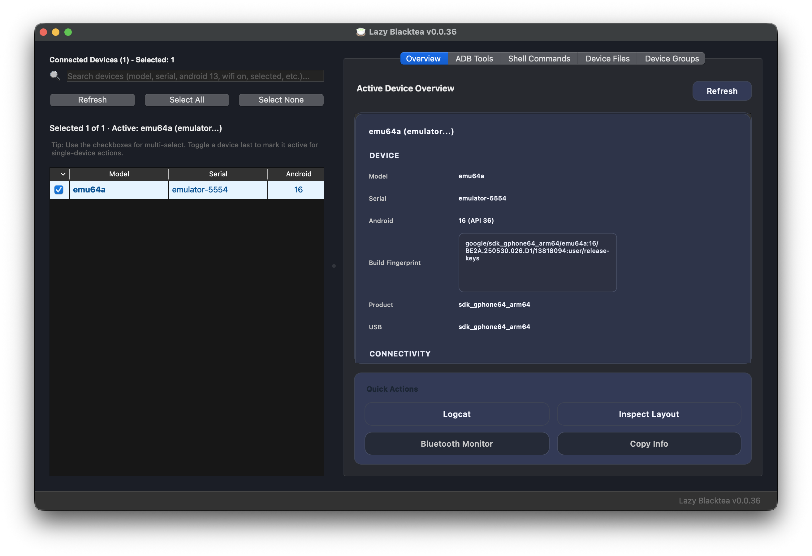

# Lazy Blacktea


[](https://github.com/cy76/lazy_blacktea/actions)
[](https://github.com/cy76/lazy_blacktea/actions)
[](https://www.python.org/downloads/)
[](LICENSE)

> Current release: v0.0.41

**Languages:** English | [繁體中文](README_zh-TW.md)

## Why Lazy Blacktea?
- Monitor multiple Android devices and schedule operations from a single window.
- Ship ready-to-run automation tasks (install, record, capture, shell commands, logcat streaming).
- Offer a clear device table, progress indicators, and dual light/dark themes.
- Accelerate heavy I/O and file workloads with a Rust native companion module.
- Rely on built-in tests and CI pipelines to lower regression risks.

## Quick Start
### Requirements
- Python 3.8 or newer.
- Android SDK Platform Tools with `adb` available on your `PATH`.
- A macOS or Linux desktop environment.
- (Optional) Rust and Cargo if you plan to rebuild the native module.

### First-Time Setup
```bash
# Clone the repository
git clone https://github.com/cy76/lazy_blacktea.git
cd lazy_blacktea

# (Recommended) create a virtual environment
python3 -m venv .venv
source .venv/bin/activate

# Install dependencies
pip install -r requirements.txt
```

### Launch the App
```bash
python3 lazy_blacktea_pyqt.py
```
For headless environments (CI, remote), add `QT_QPA_PLATFORM=offscreen`.

### Run the Automated Tests
```bash
python3 tests/run_tests.py
```
Run the full suite before every commit to keep the project stable.

## Core Features
| Area | Highlights | Key Modules |
| --- | --- | --- |
| Device management | Live discovery, grouping, and dynamic refresh | `ui.async_device_manager`, `ui.device_manager` |
| Automation tasks | Batch installs, bug reports, shell, recording, screenshots | `ui.device_operations_manager`, `utils.adb_tools` |
| File workflows | Browse device files, preview, and coordinate export paths | `ui.device_file_browser_manager`, `utils.file_generation_utils` |
| Diagnostics | Logcat streaming, error classification, completion dialogs | `ui.logcat_viewer`, `ui.console_manager`, `ui.error_handler` |
| Performance | Debounced refresh, batched UI updates, native helpers | `utils.debounced_refresh`, `utils.task_dispatcher`, `native_lbb` |

## UI Preview


## Project Tour
| Path | Purpose | Highlights |
| --- | --- | --- |
| `lazy_blacktea_pyqt.py` | Application entry point | Bootstraps Qt, registers managers, configures logging |
| `ui/` | UI widgets and controllers | Device list, tool panels, file browser, logcat viewer |
| `utils/` | Shared utilities | ADB façade, logging, scheduling, Qt dependency checks, native bridge |
| `config/` | Configuration modules | Constants, preference storage, paths, logcat options |
| `tests/` | Test suites | Unit, integration, performance smoke tests via `tests/run_tests.py` |
| `assets/` | Static assets | Icons and branding resources |
| `build_scripts/`, `build-scripts/` | Packaging toolchain | PyInstaller specs, platform launch scripts, build helpers |
| `native_lbb/` | Rust project | Optimized routines for high-volume operations |
| `scripts/` | Automation scripts | Utilities like `bump_version.py` for release chores |

## Architecture Overview
- `lazy_blacktea_pyqt.py` orchestrates UI composition and cross-module signals.
- `ui/` manages visual components and state via explicit signal/slot wiring.
- `utils/` wraps ADB, scheduling, structured logging, and the native bridge.
- `config/` stores defaults and persists user preferences.
- `native_lbb/` delivers optimized routines for intensive I/O workloads.
- `tests/` enforces the testing pyramid for functionality, performance, and concurrency safety.

## Development & Tooling
- Startup script `./start_lazy_blacktea.sh` checks Python/ADB readiness before booting the GUI.
- Frequently used commands:
  - `python3 -m pytest tests/test_async_device_performance.py`: concurrency-focused tests.
  - `cargo build --release` (inside `native_lbb/`): rebuild the native module.
- Follow TDD: write the test, implement the feature, then refactor.

## Packaging & Release
- Use PyInstaller specs under `build-scripts/` to build macOS and Linux bundles.
- Platform scripts:
  - `build-scripts/build_macos.sh`
  - `build-scripts/build_linux.sh`
- Keep version identifiers aligned:
  - `VERSION`
  - `config/constants.py::ApplicationConstants.APP_VERSION`
  - README `Current release` badge (manually or via `scripts/bump_version.py`).

## Native Companion
- `native_lbb` is the Rust crate powering batched file operations and metadata gathering.
- Build it locally with:
  ```bash
  cd native_lbb
  cargo build --release
  ```
- Python loads the resulting shared library through `utils.native_bridge`; ensure the artifact sits on the dynamic loader path or configure environment variables accordingly.

## Performance, Observability & Troubleshooting
- Key techniques: debounced refreshes, batched UI updates, async I/O, and offloading to Rust helpers.
- Logging uses `utils.common.get_logger` for structured messages and trace IDs.
- Common issues:
  - **ADB not found**: set `ANDROID_HOME` or `ANDROID_SDK_ROOT`, or configure a custom path in-app.
  - **Permission errors**: enable USB Debugging and root access where required.
  - **Slow discovery**: restart ADB (`adb kill-server && adb start-server`) and clear `/tmp/lazy_blacktea_*` artifacts.
  - **Qt plugin warnings**: run `utils.qt_dependency_checker.check_and_fix_qt_dependencies()` and confirm clean output.
  - **Headless runs**: export `QT_QPA_PLATFORM=offscreen`.

## Community & Support
- Issue tracker: <https://github.com/cy76/lazy_blacktea/issues>
- Discussions: <https://github.com/cy76/lazy_blacktea/discussions>
- Contribution guide: [`CONTRIBUTING.md`](CONTRIBUTING.md)
- Security reports: submit privately via GitHub Security Advisories.

## How to Contribute
1. Fork the repository and create a feature branch.
2. Practice TDD: add tests, implement the change, refactor when green. Use Conventional Commits.
3. Run `python3 tests/run_tests.py` and update docs or performance notes as needed.
4. Open a pull request with test results, screenshots for UI changes, and relevant context.

## License
Lazy Blacktea ships under the [MIT License](LICENSE); PyQt6 and third-party dependencies keep their respective licenses.

## Roadmap
- Provide richer automation templates and script samples.
- Sync preferences, tagging, and usage metrics via optional cloud services.
- Expand Windows support (experimental).
- Add guided onboarding and interactive tutorials.

Like the project? Drop a ⭐, share it with your team, and tell us how it helped!
